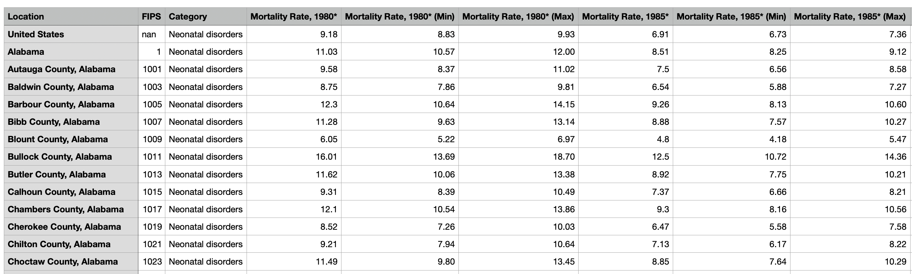
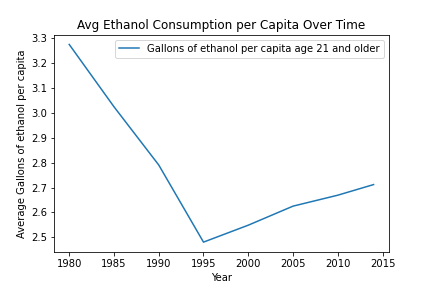
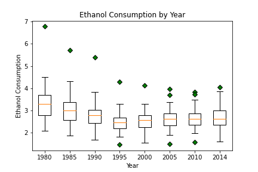
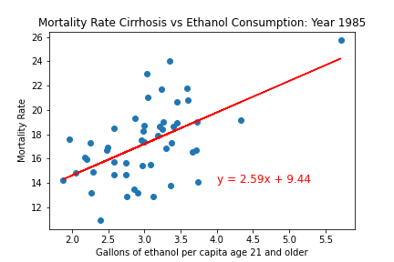
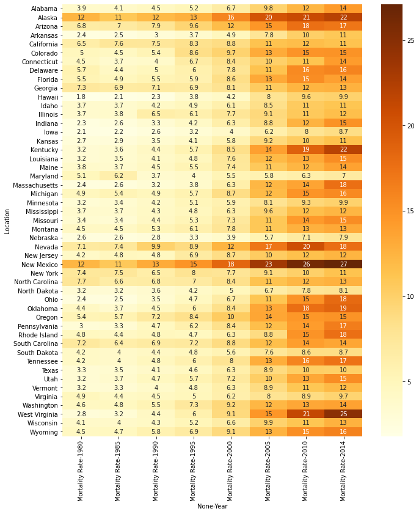

### Alcohol Consumption and Mortality

**Project Description:**

Our group analyzed mortality rates by state and compared them with the alcohol consumption volume per person in states for several different causes of death.

**Questions:**

* Is there a correlation between ethanol consumption and various mortality rates?
* Correlation between average alcohol consumption and mortality rate?
* Correlation over the corresponding years of data?

**Data Sources:**

Consumption of alcohol per capita in each of 50 states + DC from 1970 - 2019 [[National Institute of Health]](https://pubs.niaaa.nih.gov/publications/surveillance117/pcyr1970-2019.txt)

Mortality rates by state and county for 21 categories in 8 different years from 1980 - 2014 [[Journal of American Medical Association (via Kaggle)]](https://www.kaggle.com/IHME/us-countylevel-mortality)

#### **Data Cleaning:** 

Screenshot of Alcohol Data File

Screenshot of Mortality Data File

**Mortality Categories:**

* HIV/AIDS & Tuberculosis
* Maternal Disorders
* Neonatal Disorders
* Nutritional Deficiencies
* Cardiovascular Diseases
* Cirrhosis & Other Chronic
* Neurological Disorders
* Mental Substance Abuse
* Diabetes Urogenital Blood
* Transport Injuries
* Unintentional Injuries
* Self Harm / Interpersonal

**Ethanol Consumption (Beverage Types):**

* Spirits
* Wines
* Beer
* All Beverages

**Years:** 1980, 1985, 1990, 1995, 2000, 2005, 2010, 2014

**Population:** Gallons of Ethanol Consumption per capita Age 21 and Older

****

**Analysis:**

Final Analysis file: "Alcohol and Mortality Analysis.ipynb"

Line Graph of the Average Ethanol Consumption Over All Years

Box Plot of Ethanol Consumption Over All Years

**ANOVA Test of Ethanol Consumption by Year**

The change in ethanol consumption is significant from year to year.

Correlation of alcohol consumption and mortality types

* Strongest positive correlation = Cirrhosis

* Strongest negative correlation = Diabetes and Cardiovascular

Table of the Strongest Positive and Negative Correlations
 

Scatter Plot of the Strongest Correlation Between Mortality Type Cirrhosis and Ethanol Consumption in 1985
  

Heatmap Example for Mortality Type Mental/Substance Use

*  This shows an increase in mental and substance abuse mortality over time

*  The mortality rate is higher in states such as Alaska, New Mexico, and West Virginia than compared to the rest of the country

**Conclusions:**

* General correlation over all years is weaker than individual years
* Moderate positive correlation for several mortality categories
* Correlations between ethanol consumption and mortality rates associated with cirrhosis and mental/substance use moderate over multiple years
* Ethanol consumption in the US has changed over the years analyzed - curious drop in consumption from 1980 to 1995
* Negative correlations between ethanol consumption and mortality rates associated with cardio and diabetes

**Group name:** Data Crushers

**Group members:** Heather Mott, Rosali Gonzalez, Saleha Ahmed, Steven Rodriguez, Tinu Adepoju, Walter DePalma

